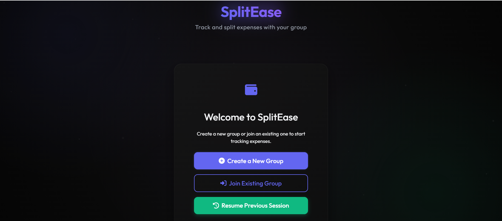
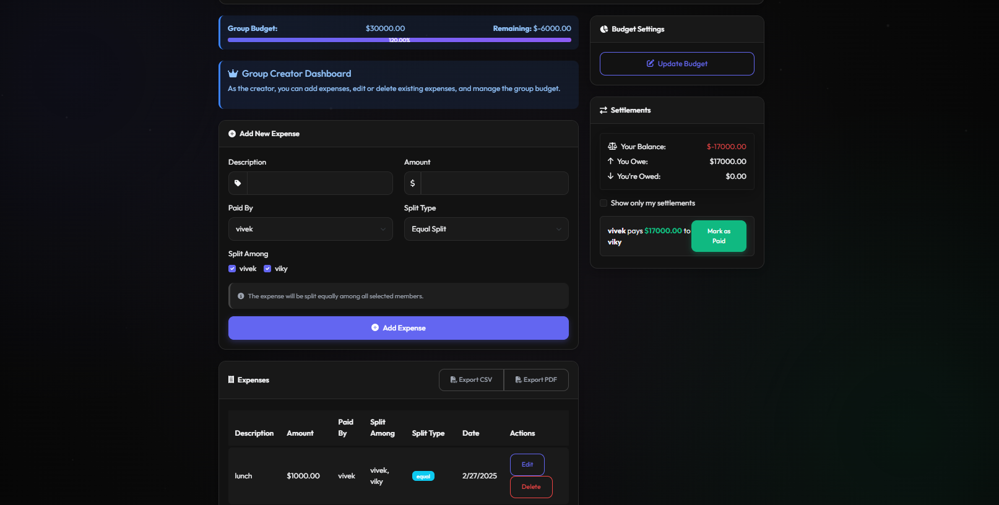

# SplitEase

<div align="center">
  
  <h2>Smart Group Expense Tracker</h2>
  <p><em>Split expenses, track balances, and manage group finances with ease</em></p>
  
  [](https://nodejs.org/)
  [](https://expressjs.com/)
  [](https://www.sqlite.org/)
  [](https://getbootstrap.com/)
  
  [Overview](#-overview) • 
  [Features](#-features) • 
  [Screenshots](#-screenshots) • 
  [Installation](#-setup--installation) • 
  [Roadmap](#-roadmap) • 
  [Contributing](#-contributing)
</div>

## 🌟 Overview

**SplitEase** is a hassle-free group expense tracker designed to simplify shared finances. Whether you're roommates splitting rent, friends on vacation, or colleagues managing office expenses, SplitEase provides an intuitive platform to:

- Track who paid what and who owes whom
- Split expenses using various methods
- Visualize spending patterns
- Settle debts efficiently

No more spreadsheets, mental calculations, or awkward money conversations!

## ✨ Features

| Feature | Description |
|---------|-------------|
| 📊 **Smart Expense Splitting** | Split bills equally, by percentage, fixed amounts, or shares |
| 👥 **Group Management** | Create multiple groups for different expense categories or social circles |
| 🏦 **Budget Tracking** | Set group budgets and receive notifications when approaching limits |
| 📱 **Responsive Design** | Access from any device with a fully responsive interface |
| 📅 **Transaction History** | View complete expense history with filtering and search capabilities |
| 🔄 **Real-time Updates** | Instant synchronization when expenses are added or modified |
| 📊 **Balance Summary** | At-a-glance view of who owes what to whom |
| 💳 **Payment Integration** | *(Planned)* Settle debts directly through the app with Razorpay |

## 🛠️ Tech Stack

<div align="center">

| Layer | Technologies |
|-------|-------------|
| **Frontend** | HTML5, CSS3, Bootstrap 5, JavaScript (ES6+) |
| **Backend** | Node.js, Express.js, RESTful API |
| **Database** | SQLite (with Sequelize ORM) |
| **Authentication** | JWT, bcrypt |
| **Payment** | Razorpay API *(Planned)* |
| **Deployment** | Docker, Nginx *(Planned)* |

</div>

## 🎮 Screenshots

<div align="center">
  
  <p><em>Create or Join a group</em></p>
  
  
  <p><em>Dashboard - Overview of group expenses and balances</em></p>
</div>

## 🚀 Setup & Installation

### Prerequisites
- Node.js (v14.x or higher)
- npm (v6.x or higher)

### Installation Steps

1️⃣ **Clone the repository**
```bash
git clone https://github.com/rimuru2725/SplitEase.git
cd SplitEase
```

2️⃣ **Install dependencies**
```bash
npm install
```

3️⃣ **Configure environment variables**
```bash
cp .env.example .env
# Edit .env with your configuration
```

4️⃣ **Initialize the database**
```bash
npm run init-db
```

5️⃣ **Start the development server**
```bash
npm run dev
```

6️⃣ **Access the application**
Open your browser and navigate to `http://localhost:3000`

### Docker Deployment (Coming Soon)
```bash
docker-compose up -d
```

## 📊 API Documentation

SplitEase provides a RESTful API for all operations. Documentation is available at `/api/docs` when running the server.

Key endpoints include:

- `GET /api/groups` - List all groups
- `POST /api/expenses` - Create a new expense
- `GET /api/users/:id/balance` - Get balance summary for a user

## 📱 Mobile App

A React Native mobile application is currently in development to complement the web interface, providing on-the-go expense tracking.

## 🔮 Roadmap

<div align="center">

| Feature | Status | Expected |
|---------|--------|----------|
| 📱 **Mobile Application** | In Design | Q3 2023 |
| 💰 **Expense Analytics** | In Progress | Q2 2023 |
| 💳 **Razorpay Integration** | Under Development | Q2 2023 |
| 🌐 **Multi-currency Support** | Planned | Q4 2023 |
| 🔔 **Push Notifications** | Planned | Q3 2023 |
| 📊 **Advanced Reports** | Planned | Q4 2023 |
| 🔄 **Recurring Expenses** | Planned | Q1 2024 |

</div>

## 🤝 Contributing

We welcome contributions from the community! To contribute:

1. Fork the repository
2. Create a feature branch (`git checkout -b feature/amazing-feature`)
3. Commit your changes (`git commit -m 'Add some amazing feature'`)
4. Push to the branch (`git push origin feature/amazing-feature`)
5. Open a Pull Request

Please read our [Contributing Guidelines](CONTRIBUTING.md) for more details.

## 📜 License

This project is licensed under the MIT License - see the [LICENSE](LICENSE) file for details.

## 📧 Contact & Support

- **Website:** [Click Me](https://github.com/rimuru2725/SplitEase.git)
- **Email:** [Click Me](mailto:vikysharma644@gmail.com)

For bug reports and feature requests, please use the [GitHub Issues](https://github.com/rimuru2725/SplitEase/issues).

---

<div align="center">
  <p>
    
    <b>Built with passion by VIVEK</b>
  </p>
  <p>
    <a href="https://github.com/rimuru2725">GitHub</a> •
    <a href="https://www.linkedin.com/in/vivek-sharma-06219a28b/">LinkedIn</a> •
  </p>
</div>