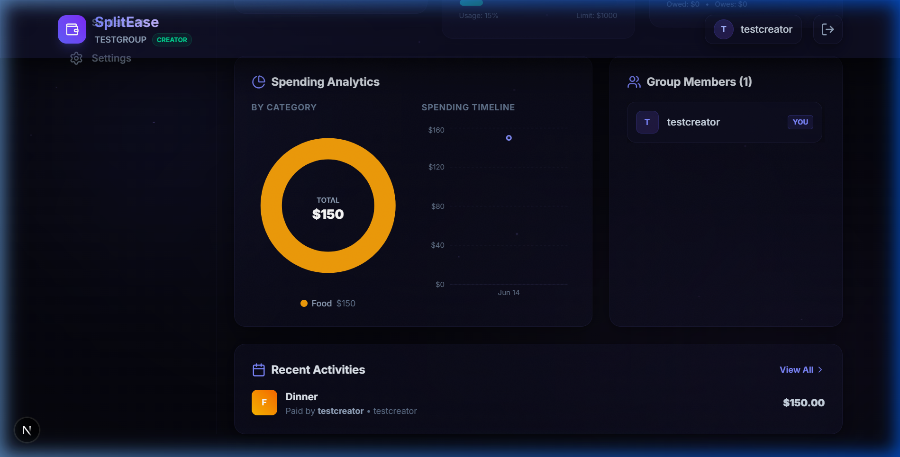
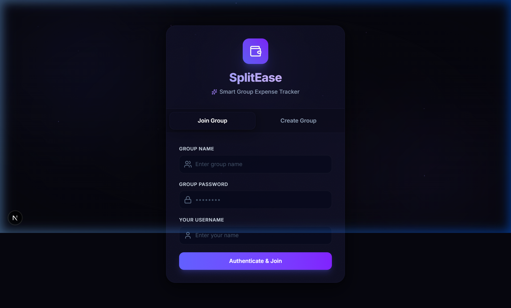
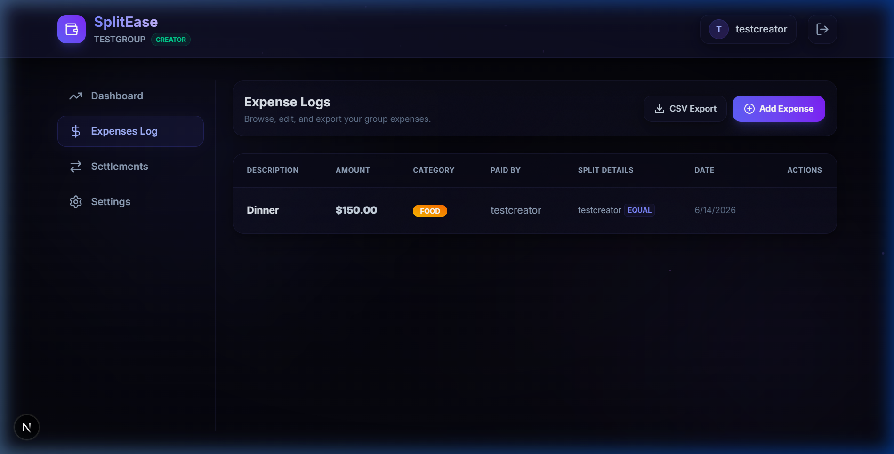
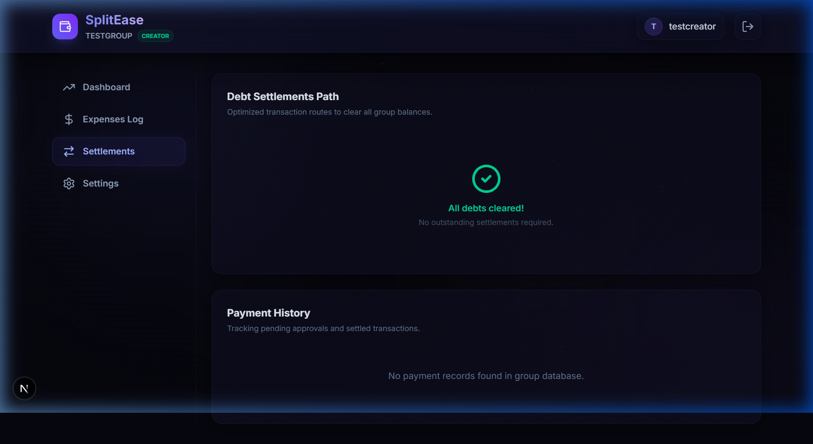
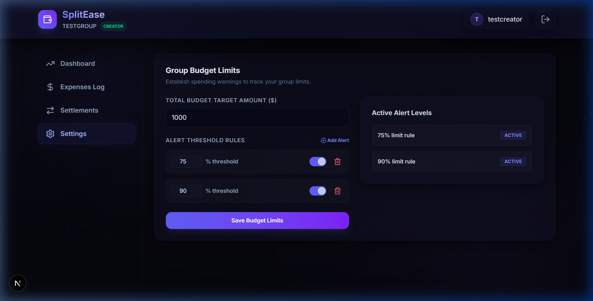
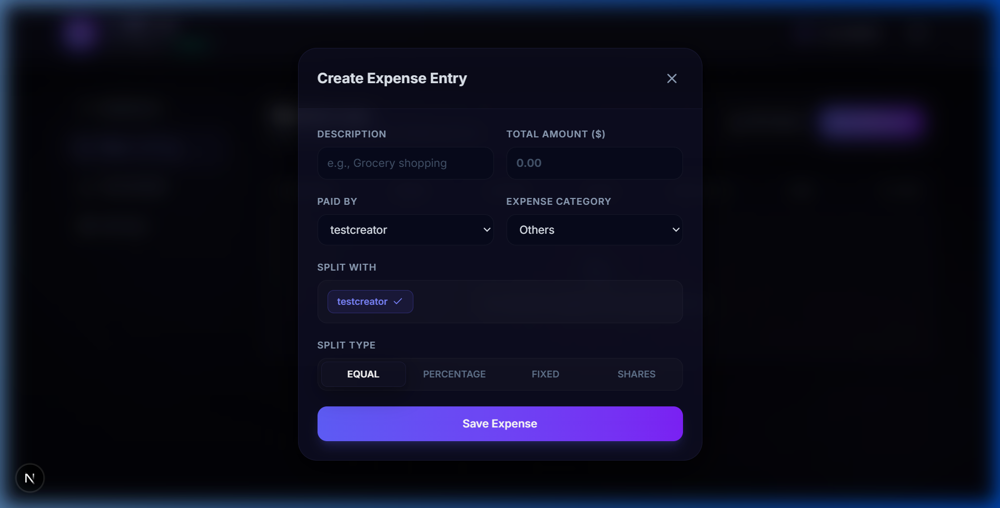

# SplitEase 💳

<div align="center">
  
  <h2>Smart Group Expense Tracker & Financial Ledger</h2>
  <p><em>Split expenses, analyze visual dashboards, track budgets, and manage group finances securely.</em></p>
  
  [](https://nextjs.org/)
  [](https://react.dev/)
  [](https://www.sqlite.org/)
  [](https://tailwindcss.com/)
  
  [Overview](#-overview) • 
  [Architecture & Hardening](#-architecture--hardening) • 
  [Key Features](#-key-features) • 
  [Tech Stack](#-tech-stack) • 
  [Installation](#-setup--installation) • 
  [API Endpoints](#-api-endpoints)
</div>

---

## 🌟 Overview

**SplitEase** is a modern, premium web application designed to simplify shared finances for roommates, friends on vacation, or team events. It removes spreadsheets and awkward money conversations by providing:

1. **Stunning Glassmorphism Frontend**: Features interactive charts, 3D tilt effects, spring micro-animations, and animated counters.
2. **Hardened Security & Database**: Protected by IP rate limiters, atomic transactions, automatic foreign key cascades, Zod validations, and strict data consistency checks.

---

## 🛡️ Architecture & Hardening

SplitEase is built with production-grade backend design patterns:

### 1. Robust Middleware wrappers
All API route handlers leverage unified decorators for security, reliability, and structured error formatting:
*   `apiHandler`: Catches global exceptions and formats unified JSON responses with standard HTTP status codes.
*   `withAuth`: Extracts and decodes the JWT session token, passing the authenticated session details.
*   `withRateLimit`: Protects endpoints from abuse using sliding-window rate limiters.

### 2. Database Performance & Atomicity
*   **Write-Ahead Logging (WAL)**: Enabled in SQLite to allow multiple threads to read concurrently while write actions compile, reducing lock contentions.
*   **Indices**: Custom database indexes are configured on performance-critical columns (`group_id`, `created_at`).
*   **Transactions**: Multi-statement inserts and updates are executed inside database transactions ensuring zero partial states on validation failure.

### 3. Rate Limiting Throttling
We implemented a zero-dependency in-memory sliding window rate limiter (with LRU eviction to prevent memory leaks):
*   `auth`: 5 requests per 60 seconds per IP.
*   `write`: 30 requests per 60 seconds per IP.
*   `read`: 60 requests per 60 seconds per IP.

---

## ✨ Key Features

| Feature | Details |
|---|---|
| 📈 **Custom Splits** | Split expenses equally, by percentage, fixed amount, or shares. |
| 📊 **Spend Visualization** | Real-time charts (donut for categories, area for trends) via Recharts. |
| 🛡️ **Budget Thresholds** | Configure custom budget limits with automated percentage alerts. |
| 📜 **Audit Trail Log** | High-fidelity paginated activity tracker showing every edit, creation, deletion, or payment event. |
| 🔄 **Recurring Templates** | Create weekly/monthly templates that automatically compute next-due dates. |
| 👥 **Safe Member Leaving** | Prevents members from leaving or being removed if they have a non-zero balance to protect accounting history. |

---

## 🛠️ Tech Stack

*   **Frontend**: Next.js 16 (App Router), React 19, Framer Motion 12, Recharts 3, TailwindCSS 4, Lucide Icons.
*   **Backend & Security**: Node.js, JSON Web Tokens (JWT), bcryptjs, Zod v4 (validation), sliding-window rate limiting.
*   **Database**: SQLite (`sqlite3` / `sqlite`), WAL Mode, transactional integrity, indices, cascade foreign keys.

---

## 🎮 Screenshots & Visual Demos

<div align="center">
  <h3>1️⃣ Interactive Dashboard & Spatial Analytics</h3>
  <p>Track group balances, categorize expenses dynamically with Recharts, and review the recent activity feed.</p>
  

  <h3>2️⃣ Create or Join Group (3D Glassmorphism Interface)</h3>
  <p>Dynamic 3D-tilt interaction, animated ambient floating gradient orbs, and clean setup wizard.</p>
  

  <h3>3️⃣ Staggered Expense Log & Settlement Tracking</h3>
  <p>Browse individual ledger entries with spring reveals, view optimized payment paths, and settle balances instantly.</p>
  
  

  <h3>4️⃣ Custom Budget Alerts & Admin Controls</h3>
  <p>Configure custom budget ceilings and add percentage alert triggers to control spending limits.</p>
  

  <h3>5️⃣ Spring Action Add-Expense Drawer</h3>
  <p>Physics-based scale adjustments for quick, custom splitting among members.</p>
  

  <h3>🎥 Full UI Flow Walkthrough</h3>
  <p>Floating orbs, number counters counting from 0 to target, and page tabs switching smoothly.</p>
  
</div>

---

## 🚀 Setup & Installation

### Prerequisites
*   Node.js (v18.x or higher)
*   npm (v9.x or higher)

### Installation Steps

1️⃣ **Clone the repository**
```bash
git clone https://github.com/rimuru2725/SplitEase.git
cd SplitEase/splitease
```

2️⃣ **Install dependencies**
```bash
npm install
```

3️⃣ **Run the development server**
```bash
npm run dev
```
Open [http://localhost:3000](http://localhost:3000) in your browser.

4️⃣ **Verify compilation**
```bash
npm run build
```

---

## 📊 API Endpoints

All endpoints are validated using Zod, rate-limited, and require JWT authentication via the `Authorization: Bearer <token>` header (or `?token=<token>` query parameter for file exports).

### Auth Endpoints
*   `POST /api/auth/create-group` — Create group, add creator, set default alerts (75% / 90%), return JWT session.
*   `POST /api/auth/join-group` — Verify password, add member, return JWT session.

### Expenses
*   `GET /api/expenses` — List group expenses (newest first).
*   `POST /api/expenses` — Create a new expense (validated against splits & budget alerts).
*   `PUT /api/expenses/[id]` — Edit a group expense (creator or payer only).
*   `DELETE /api/expenses/[id]` — Delete an expense (creator or payer only).

### Settlements & Payments
*   `GET /api/settlements` — Calculate optimized settlements and user balances.
*   `POST /api/settlements/pay` — Create payments, confirm receipts, or reject/cancel pending payments.

### Group Management
*   `GET /api/group/info` — Fetch group budget statistics and alert thresholds.
*   `PUT /api/group/budget` — Update budget setting and set custom threshold percentages (creator only).
*   `POST /api/group/members` — Remove a group member or self-removal (requires zero balance check).
*   `POST /api/group/delete` — Delete group and cascade delete all child transactions (creator only, requires password check).

### Recurring Expenses
*   `GET /api/recurring` — List active/inactive recurring expense templates.
*   `POST /api/recurring` — Create a recurring template.
*   `PUT /api/recurring/[id]` — Edit template active state/fields.
*   `DELETE /api/recurring/[id]` — Delete template.

### Other Endpoints
*   `GET /api/users` — Fetch users in the group.
*   `GET /api/activity` — Paginated audit log/activity stream.
*   `GET /api/export/csv` — Export all expenses to CSV spreadsheet.

---

<div align="center">
  <p><b>Built by VIVEK</b></p>
  <p>
    <a href="https://github.com/rimuru2725">GitHub</a> •
    <a href="https://www.linkedin.com/in/vivek-sharma-06219a28b/">LinkedIn</a>
  </p>
</div>